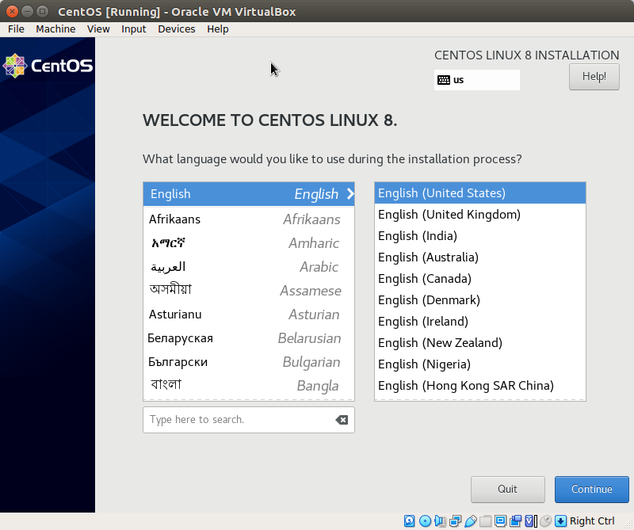

# CentOS VM on virtualbox
- install [CentOS 8](http://mirror.marwan.ma/centos/8.5.2111/isos/x86_64/) on virtual machine.

## Virtualbox configuration


enable `nested VT-x/AMD-V`
```bash
VBoxManage modifyvm CentOS --nested-hw-virt on
```
## Installation


 



# Post installation 
```bash
yum -y update && yum -y install \
nano \
bash-completion \
net-tools \
wget \
git \
curl
```
```bash
echo -e "LANG=en_US.utf-8\nLC_ALL=en_US.utf-8\n" > /etc/environment
```

`ifconfig` to get your ip address ex: `192.168.43.113`

```bash
hostnamectl set-hostname osp.at.dz
```

```bash
dnf config-manager --enable powertools
dnf install -y centos-release-openstack-victoria
dnf update -y
```

```bash
yum repolist # to check repo list
```

```bash
echo "192.168.43.113	osp.at.dz" >> /etc/hosts # for test env, we don't need this in production env
```

```bash
systemctl disable firewalld
systemctl stop firewalld
```

```bash
nano /etc/sysconfig/network-scripts/ifcfg-enp0s3
```

```clike
TYPE=Ethernet
PROXY_METHOD=none
BROWSER_ONLY=no
BOOTPROTO=static
DEFROUTE=yes
IPV4_FAILURE_FATAL=no
IPV6INIT=no 
IPV6_AUTOCONF=no 
IPV6_DEFROUTE=no 
IPV6_FAILURE_FATAL=no
NAME=enp0s3
DEVICE=enp0s3
ONBOOT=yes
IPADDR=192.168.43.113
NETMASK=255.255.255.0
GATEWAY=192.168.43.1
DNS1=192.168.43.1
```

```bash
 cp /etc/sysconfig/network-scripts/ifcfg-enp0s3 .   #backup
```

```bash
echo "192.168.43.113	osp.at.dz" >> /etc/hosts
```

```bash
rpm -qa | grep -i network-scripts # should output nothing
```

```bash
yum install network-scripts
```

```bash
systemctl disable NetworkManager
systemctl stop NetworkManager

systemctl enable network
systemctl start network
```

## ping test

```bash
ping google.com # OK
```

# Install  Packstack Installer

```bash
dnf install -y openstack-packstack
```

```bash
packstack --version
```

## Run Packstack to install OpenStack

```bash
packstack --gen-answer-file=/root/answers.txt \
--os-neutron-ml2-tenant-network-types=vxlan \
--os-neutron-l2-agent=openvswitch \
--os-neutron-ml2-type-drivers=vxlan,flat \
--os-neutron-ml2-mechanism-drivers=openvswitch \
--keystone-admin-passwd=admin \
--nova-libvirt-virt-type=kvm \
--provision-demo=n \
--os-heat-install=n \
--cinder-volumes-create=n \
--os-swift-storage-size=10G
```

```bash
packstack --answer-file=/root/answers.txt
```

## Troubleshooting

`ERROR : The cinder server should contain a volume group`

1. create a hard disk with vbox

1. 

	```bash
	pvcreate /dev/sdb
	vgcreate cinder-volumes /dev/sdb
	```


## Finally

go to the [dashboard](http://192.168.43.113/dashboard)


# gg
- go to http://192.168.43.113/dashboard/project/api_access/

- download openstack RC file, then

```bash
source admin-openrc.sh
```

```bash
openstack image list

```


```bash
wget https://github.com/cirros-dev/cirros/releases/download/0.5.2/cirros-0.5.2-x86_64-disk.img
```

```bash
openstack image create \
    --container-format bare \
    --disk-format qcow2 \
    --file cirros-0.5.2-x86_64-disk.img \
    Cirros-0.5.2
```
Cirros: username: cirros, Password: cubswin:)

> for more [images](https://computingforgeeks.com/adding-images-openstack-glance/)

